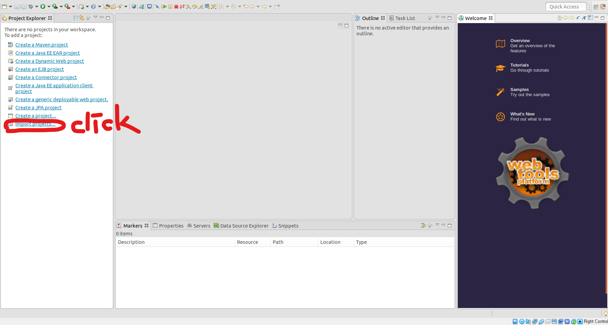
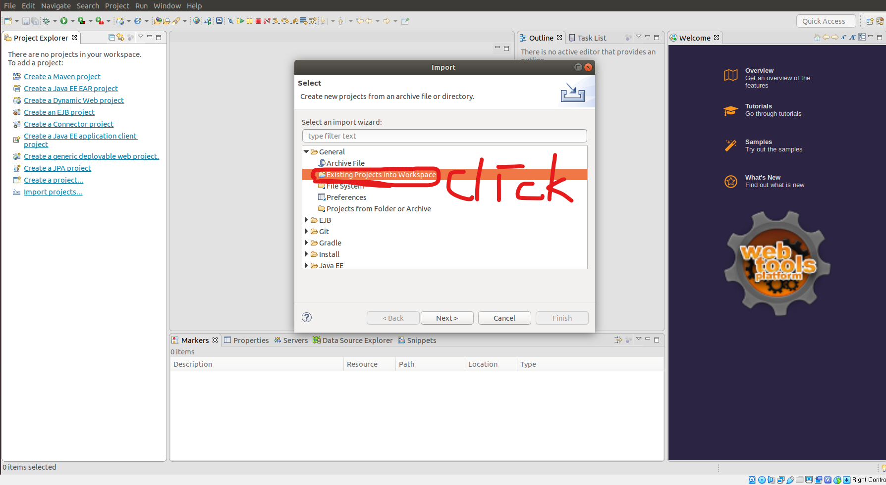
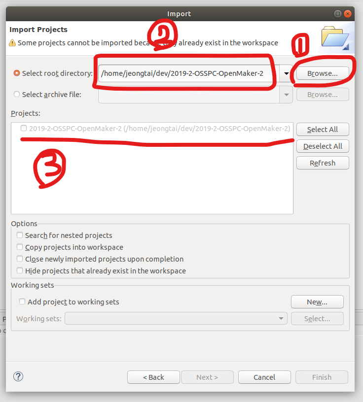

<p>
    
    
    
       
    
</p>


SuperMarioJava
==============

Basic Super Mario Bros made in Java.
The aim of this game is to collect all the coins of the levels.

Go here if you want to see a gameplay:
http://programmingheroes.blogspot.com.es/2013/05/remake-super-mario-java.html

-----------------------------------------------------------------------------


Básico juego de Super Mario Bros hecho en Java.
El objetivo es recolectar todas las monedas de cada nivel.

Para ver un vídeo del juego en funcionamiento puedes visitar:
http://programmingheroes.blogspot.com.es/2013/05/remake-super-mario-java.html

-----------------------------------------------------------------------------

## Screenshots


# 다운 및 실행방법


```bash
git clone https://github.com/CSID-DGU/2019-2-OSSPC-OpenMaker-2.git
```


- workspace로 clone 받은 상위 폴더를 지정해주고  다음에 뜨는 창에서 import project 클릭

  


- 다음 창에서 General - Existing Projects into Workspace 클릭




- clone한 폴더를 선택하고  3번 칸에 해당하는 부분이 나왔는지 꼭!!! 확인하셔야 됩니다.
  저는 지금 이미 프로젝트를 import한 상태여서  Finish 버튼이 비활성화되어 있는데요,
  처음에 하시면 활성화되어있는 Finish버튼 누르시면 끝입니다.
- 

# 사용설명서

 

- 캐릭터는 좌우로 움직일 수 있고 space 키로 점프할 수 있다.

- Shift키를 누르고 움직이거나 점프하면 이동속도 및 점프력이 증가한다.

- 캐릭터와 brick, coin, stage 등 오브젝트들의 상호작용을 통한 게임플레이 제공

- 모든 coin을 먹고 다음 포탈을 통해 다음 Stage로 이동하면 하트 +1.

- Stage 이동은 포탈에 마리오가 닿으면 이동한다.

- 코인은 캐릭터에 닿으면 자동으로 획득할 수 있다. 

- 낭떠러지(불구덩이)로 떨어지면 해당 스테이지로 초기화 되며 목숨(하트)가 하나 줄어든다.

- 하트가 0이 되면 게임은 종료된다.


  ​				![AC_[20191119-144440]](assets/AC_%5B20191119-144440%5D.gif)

  ![AC_[20191119-142409]](assets/AC_%5B20191119-142409%5D.gif)


--------------------------------------------------


